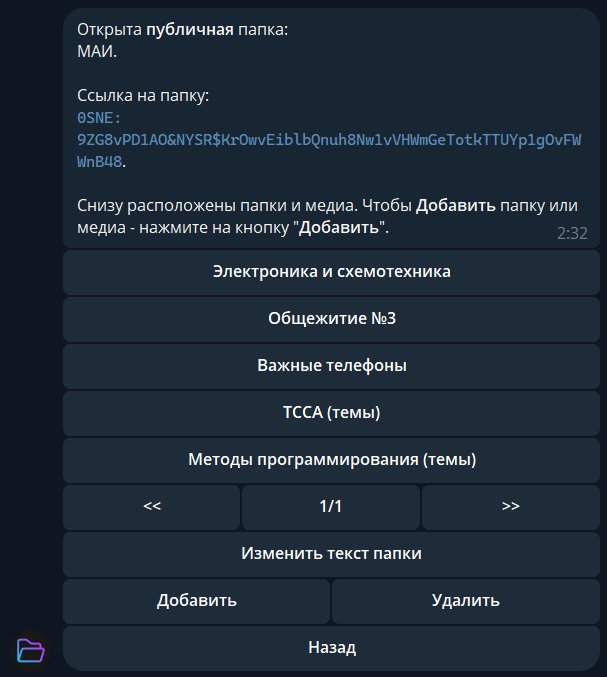
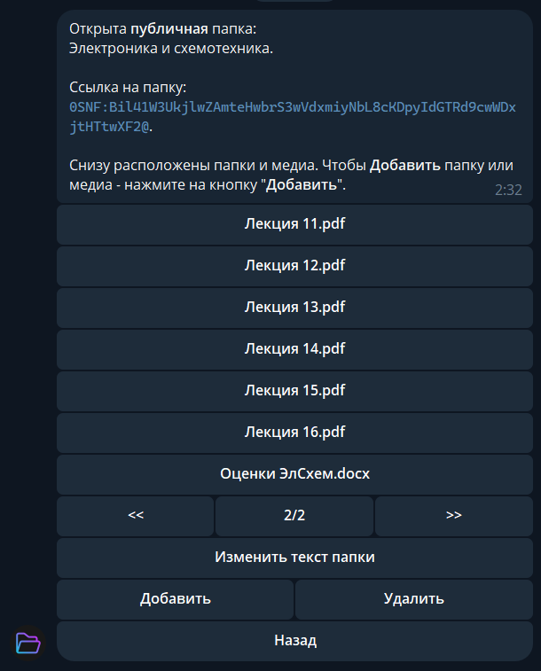
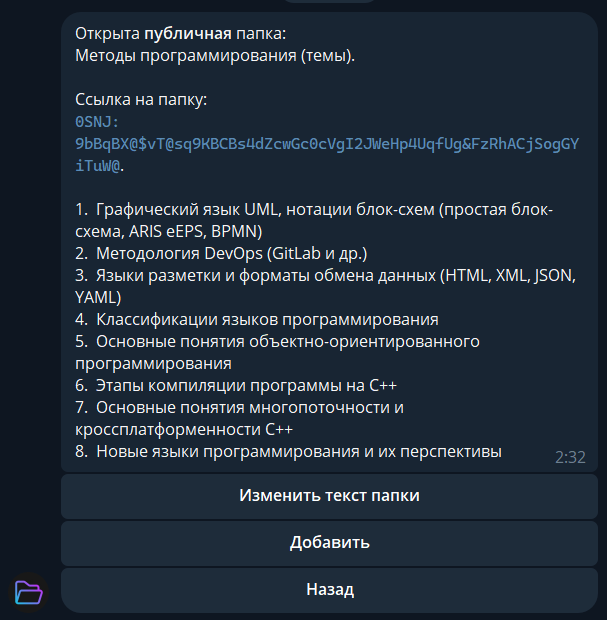

# Folders Telegram Bot


Бот для организации файлового хранилища в Telegram с иерархической системой папок.

## Пример работы


<p style="margin: 10px 0 0 0;"><em>Рис. 1: Главный интерфейс</em></p>


<p style="margin: 10px 0 0 0;"><em>Рис. 1: Главный интерфейс</em></p>


<p style="margin: 10px 0 0 0;"><em>Рис. 1: Главный интерфейс</em></p>

## Особенности

- Система вложенных папок
- Два режима доступа: публичные и приватные папки
- Хранение медиафайлов и текстовых заметок
- Возможность делиться публичными папками
- Удобная навигация с пагинацией

## Технологии

- Python 3.11+
- Aiogram 3.x
- SQLite
- HTML-разметка сообщений

## Алгоритмическая часть проекта

### Реализованные алгоритмы

#### 1. BFS (Поиск в ширину)
**Назначение**: Обнаружение циклов при добавлении папок  
**Логика работы**:  
- Последовательно проверяет все дочерние папки на текущем уровне  
- Если находит папку, которая ссылается на уже пройденную - определяет цикл  
- Гарантирует, что нельзя создать бесконечную вложенность  

#### 2. DFS (Поиск в глубину)  
**Назначение**: Рекурсивное удаление ветки папок  
**Особенности**:  
- Полностью обходит всю иерархию вглубь  
- Собирает все файлы и подпапки для пакетного удаления  
- Автоматически обрабатывает зависимости  

#### 3. Дополнительные алгоритмы
- **Хеширование путей**: Кодирование/декодирование ссылок на папки  
- **Пагинация**: Алгоритм разбивки на страницы с динамическим расчетом границ  
- **Валидация**: Проверка корректности имен и структурных связей  

### Архитектурные решения
1. **Графовая модель данных**:  
   - Папки = вершины графа  
   - Связи = направленные ребра  
   - Оптимизировано для частых операций обхода  

2. **Транзакционная система**:  
   - Все изменения выполняются атомарно  
   - Автовосстановление при ошибках  

3. **Кеширование**:  
   - LRU-кеш для часто запрашиваемых папок  
   - Инвалидация при изменениях  

### Производительность
- Максимальная глубина рекурсии ограничена 100 уровнями  
- Все критические операции защищены таймаутами  

## Быстрый старт

1. Клонируйте репозиторий:
```bash
git clone https://github.com/JakovManishek/FoldersTelegramBot.git
